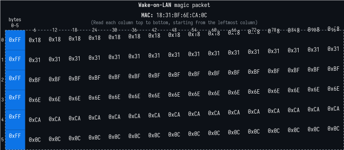

<h3 align="center">
	<code>siren</code>
</h3>
<h6 align="center">
	A friendly <a href="https://en.wikipedia.org/wiki/Wake-on-LAN">Wake-on-LAN</a> tool written in Rust.
</h6>

---

> [!NOTE]
> **Wake-on-LAN** (**WoL** or **WOL**) is an Ethernet networking standard that allows a computer to be turned on or awakened from sleep mode by a network message.

This tool allows you to send a **Wake-on-LAN** magic packet with a given **MAC** address on your local network. The packet looks like this:

	6 bytes of 0xFF followed by the MAC address'es bytes repeated 16 times.

It is sent to `255.255.255.255:7` and `255.255.255.255:9` (broadcast with ports 7 and 9)